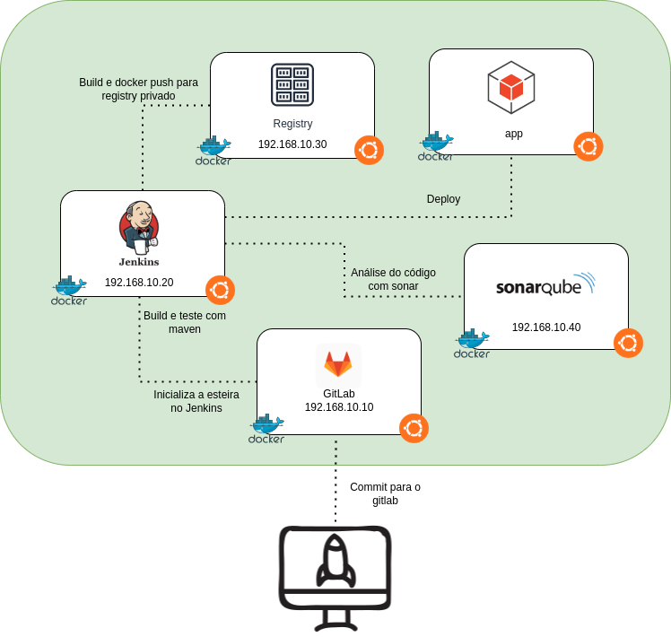
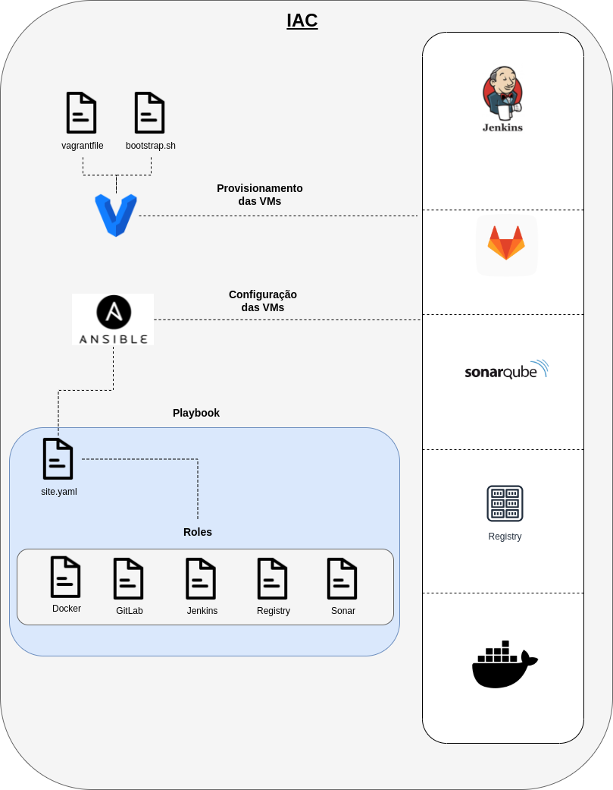

<h1 align="center">DevOps</h1>

  

  

  <a href="#-projeto">Projeto</a>&nbsp;&nbsp;&nbsp;|&nbsp;&nbsp;&nbsp;
  <a href="#-tecnologias">Tecnologias</a>&nbsp;&nbsp;&nbsp;|&nbsp;&nbsp;&nbsp;
  <a href="#%EF%B8%8F-ambiente">Ambiente</a>&nbsp;&nbsp;&nbsp;|&nbsp;&nbsp;&nbsp;
  <a href="#-execução">Execução</a>&nbsp;&nbsp;&nbsp;|&nbsp;&nbsp;&nbsp;
  <a href="#-licença">Licença</a>&nbsp;&nbsp;&nbsp;|&nbsp;&nbsp;&nbsp;
  <a href="#-referências">Referências</a>

  

## 🌱 Projeto

- Construção de uma ambiente CICD

## ✨ Tecnologias

- Vagrant  
- Ansible 
- Java 
- Springboot
- Gitlab 
- Jenkins 
- Maven 
- Sonar 
- Registry 
- Docker 

## 🛠️ Ambiente 

<h3 align="center">Arquitetura</h3>

  

## 🚀 Execução
0. [Planejamento - Etapas do projeto](./docs/stages.md) 

1. [Dependências necessárias](packages/README.md) 

2. [Chave pública e privada](keys/README.md)

3. [Provisionamento da infraestrutura](vagrant/README.MD) 

4. [Provisionamento dos serviços](roles/README.md) 

5. [Integração dos serviços](roles/integration.md) 

6. [Construção da API rest](./docs/api-rest-java.md)

7. [Desenvolvimento da Pipeline](./roles/configure_jenkins/files/jenkinsfile/README.md)

## Estudando como farei a parte de deploy

- Tecnologias sendo estudadas:
  - `Kubernetes`
  - `LENS`
  - `Argo CD`
- [Laboratório](./vagrant/k8s/README.md)

<h3 align="center">Provisionamento da Infraestrutura e Serviços</h3>

  

## 📄 Licença
Esse projeto está sob a licença MIT. Veja o arquivo [LICENSE](LICENSE) para mais detalhes.

## 🙇 Referências

1. [Ansible](https://docs.ansible.com/ansible_community.html) 
2. [Jenkins](https://www.jenkins.io/doc/) 
3. [Docker](https://docs.docker.com/)
4. [Sonar](https://docs.sonarqube.org/latest/)
5. [Integração GitLab e Jenkins](https://docs.gitlab.com/ee/integration/jenkins.html)
6. [Integração Sonarqube e Jenkins](https://docs.sonarqube.org/latest/analysis/scan/sonarscanner-for-jenkins/#:~:text=Log%20into%20Jenkins%20as%20an,a%20'Secret%20Text'%20credential.)
7. [GitLab Docker Images](https://docs.gitlab.com/ee/install/docker.html)