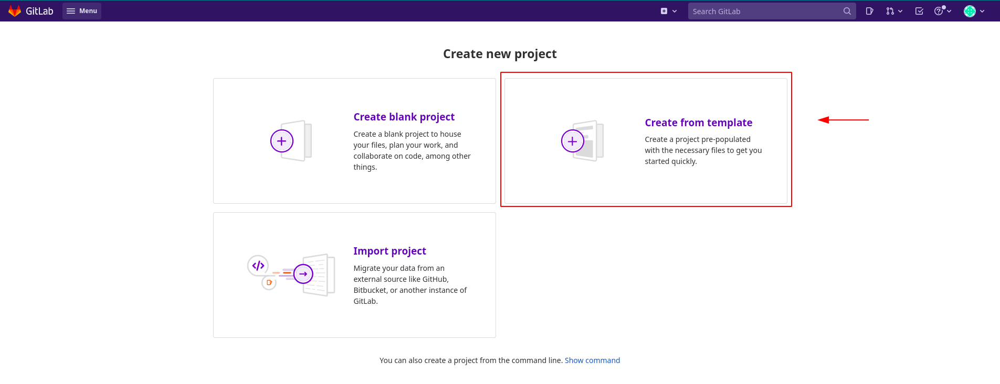
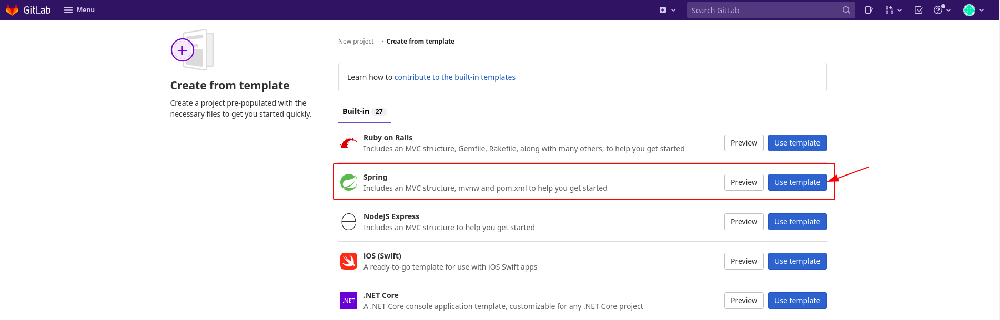
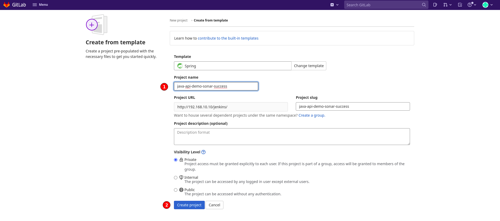
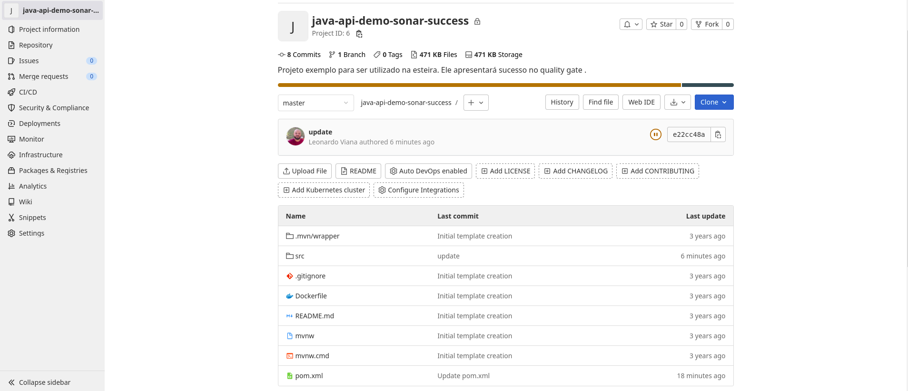
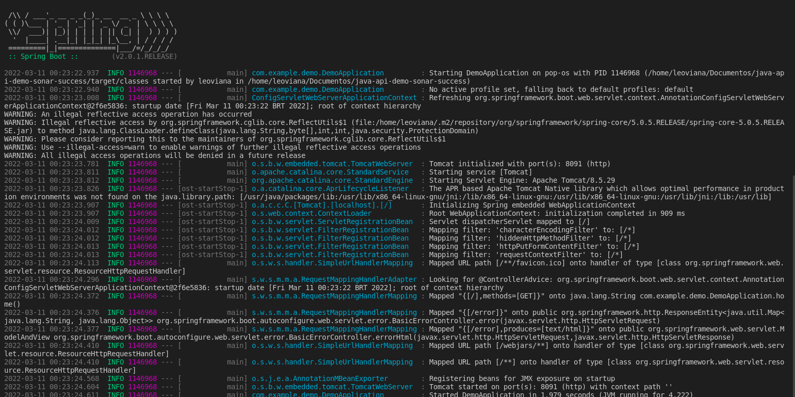

<h1 align="center">Projetos Spring</h1>

- Criação de projetos spring, vou utilizar o templates do `gitlab` para criação do projeto. Serão criados 2 projetos, um para passar com 100% na cobertura de código do sonar obtendo sucesso e outro com 50% obtendo falha.

## Criando os projetos

- Projeto 1: java-api-demo-sonar-success

- Passo 1: New Project

<p align="center">
  
</p>

- Passo 2: Criando a partir de um template

<p align="center">
  
</p>

- Passo 3: Escolhendo template springboot

<p align="center">
  
</p>

- Passo 4: Dando um nome ao projeto.
- java-api-demo-sonar-success

<p align="center">
  
</p>

- Passo 5: Projeto criado

<p align="center">
  
</p>

- Projeto 2: java-api-demo-sonar-fail
- Segue os mesmos passos do projeto 1, mudando apenas o nome do projeto.

## Executando os projetos

- Rodando o projeto

```console
mvn spring-boot:run
```

<p align="center">
  
</p>

- URL: http://localhost:8091/

<p align="center">
  
</p>
