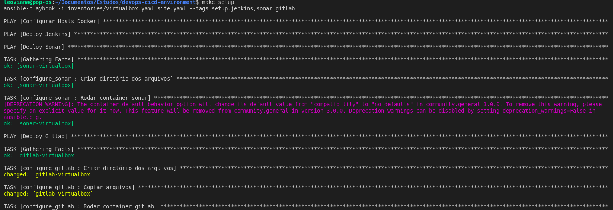

<p align="center">
  
</p>

## Roles 
- `Configure Hosts` Para configurar o docker nas VMs
- `Registry` Para subir um registry privado e poder guardar nossas imagens
- `Gitlab` Para subir um gitlab privado para versionamento do código
- `Jenkins` Para subir e configurar o jenkins
- `Sonar` Para subir o Sonar

## Inventories
- O arquivo inventories é onde estão registrados algumas variáveis de ambientes, hosts e grupos.

## Tags - site.yaml
- `site.yaml` é o arquivo princiapal, onde chamará as roles através das `tags` criadas.

  - setup
  - jenkins
  - sonar
  - gitlab
  - registry

## Inicialização 

1. Foram: Chamando diretamente pelo comando `ansible-playbook` apontando para a tag do serviço que deseja subir.

- Docker:

```console
ansible-playbook -i inventories/virtualbox.yaml site.yaml --tags setup
```

- Registry:

```console
ansible-playbook -i inventories/virtualbox.yaml site.yaml --tags registry
```

- GitLab:

```console
ansible-playbook -i inventories/virtualbox.yaml site.yaml --tags gitlab
```

- Jenkins

```console
ansible-playbook -i inventories/virtualbox.yaml site.yaml --tags jenkins
```

- Sonar:

```console
ansible-playbook -i inventories/virtualbox.yaml site.yaml --tags sonar
```

- Todos de uma vez:

```console
ansible-playbook -i inventories/virtualbox.yaml site.yaml --tags setup,gitlab,registry,sonar,jenkins
```

<p align="center">
  
</p>


2. Forma: Utilizando o `MAKEFILE`

- Configurar o Docker:
```console
make docker
```

- Configurar Jenkins:
```console
make jenkins
```

- Configurar o GitLab:
```console
make gitlab
```

- Configurar o Sonar:
```console
make sonar
```

- Configurar Registry:
```console
make registry
```

- Configurar todos de uma vez:
```console
make setup
```
<p align="center">
  
</p>

## Acessando as VMs passando o path da chave privada que foi criada para o projeto.
- GitLab
```console
ssh -i keys/vagrant vagrant@192.168.10.10
```

- Jenkins
```console
ssh -i keys/vagrant vagrant@192.168.10.20
```

- Sonar
```console
ssh -i keys/vagrant vagrant@192.168.10.40
```

- Registry
```console
ssh -i keys/vagrant vagrant@192.168.10.30
```