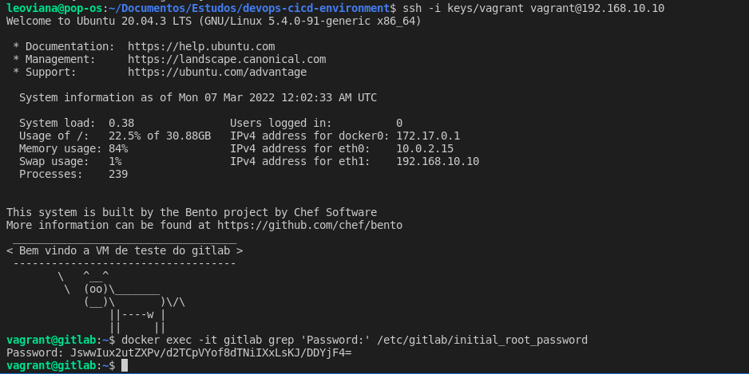
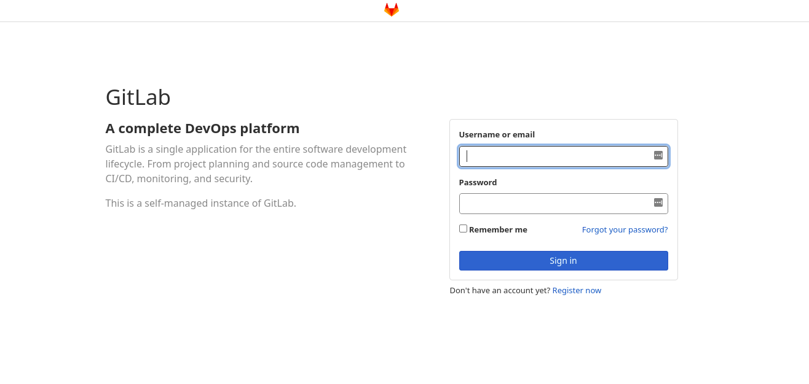
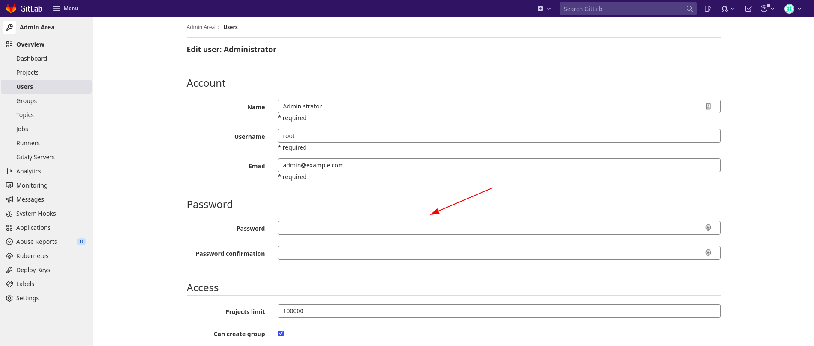
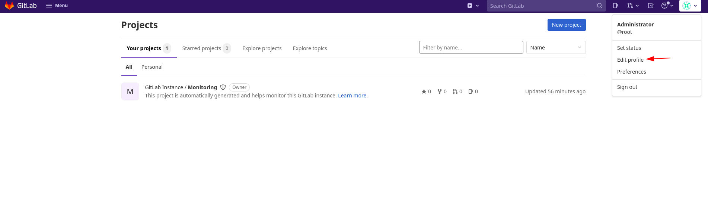
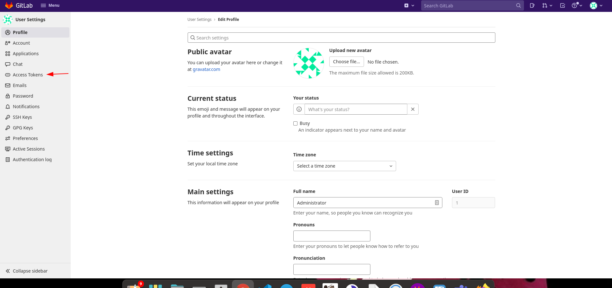
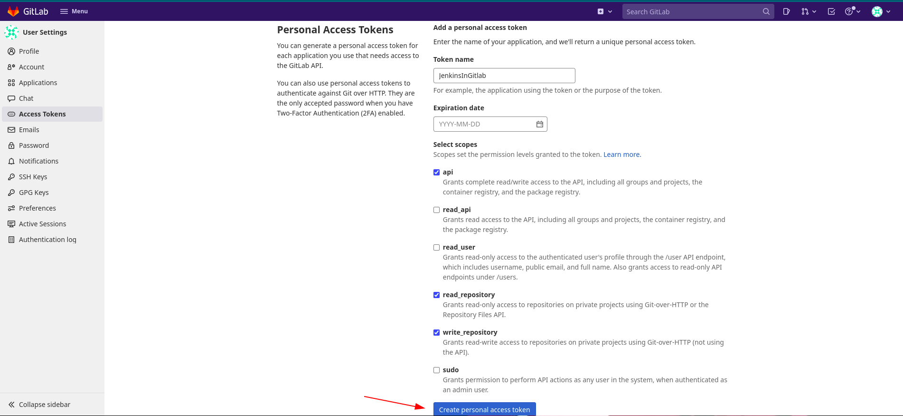
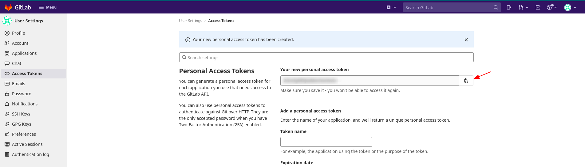

<h1 align="center">GitLab</h1>

## 1. Initial Root Password: 

1. Acessar a vm
```console
ssh -i keys/vagrant vagrant@192.168.10.10
```

2. Pegando o initial password através do comando abaixo:
```console
sudo docker exec -it gitlab grep 'Password:' /etc/gitlab/initial_root_password
```

<p align="center">
  
</p>


## 2. Login

- URL: http://192.168.10.10

<p align="center">
  
</p>

```console
user: root
password: initial_root_password
```

## 3. Redefinindo o password do `admin`

<p align="center">
  
</p>

<p align="center">
  
</p>

<p align="center">
  
</p>

<p align="center">
  
</p>

## 4. Criando um `token` para fazer a integração com o `jenkins`.

<p align="center">
  
</p>

<p align="center">
  
</p>

<p align="center">
  
</p>

<p align="center">
  
</p>

## 5. Criando usuário `jenkins`.

<p align="center">
  
</p>

<p align="center">
  
</p>

<p align="center">
  
</p>

<p align="center">
  
</p>

<p align="center">
  
</p>

<p align="center">
  
</p>