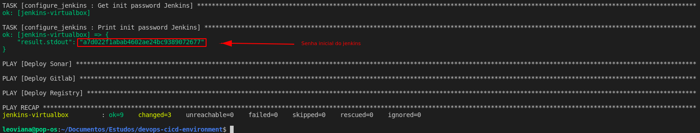

## Jenkins

## Inial Password


- Forma 1: Acessar a VM do Jenkina

```console
ssh -i keys/vagrant vagrant@192.168.10.20
docker exec jenkins cat /var/jenkins_home/secrets/initialAdminPassword
```
<p align="center">
  
</p>

- Forma 2: Rodar playbook jenkins com as tasks descomentadas - `Pegar init password Jenkins` e `Imprimir init password Jenkins`.

<p align="center">
  
</p>

- URL: http://192.168.10.20:8080/

<p align="center">
  
</p>

## Plugins necessários

- GitLab Plugin
- HTTP Request
- Config File Provider
- Logstash
- JaCoCo
- Docker
- SonarQube Scanner
- Pipeline Utility Steps