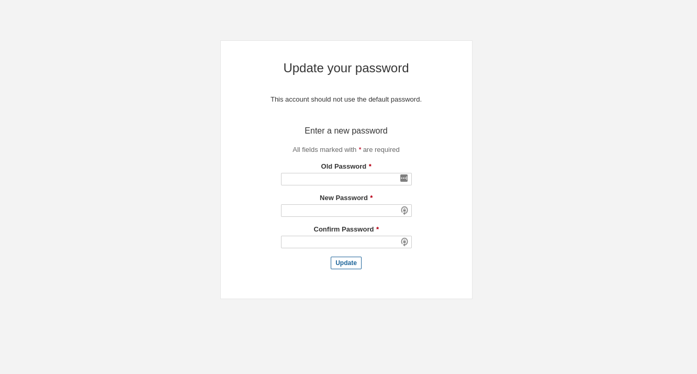
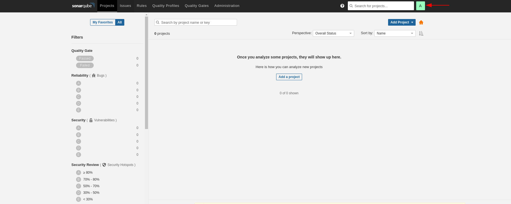
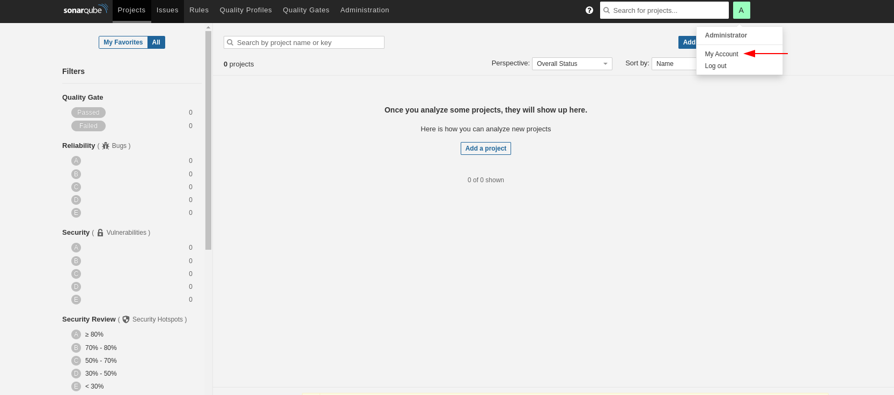
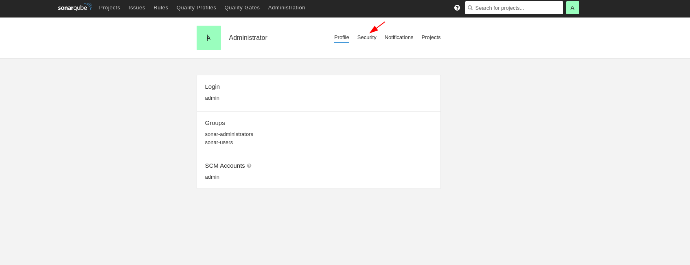
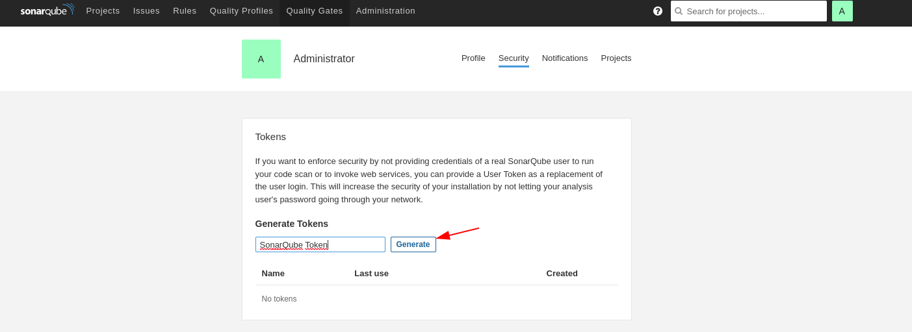
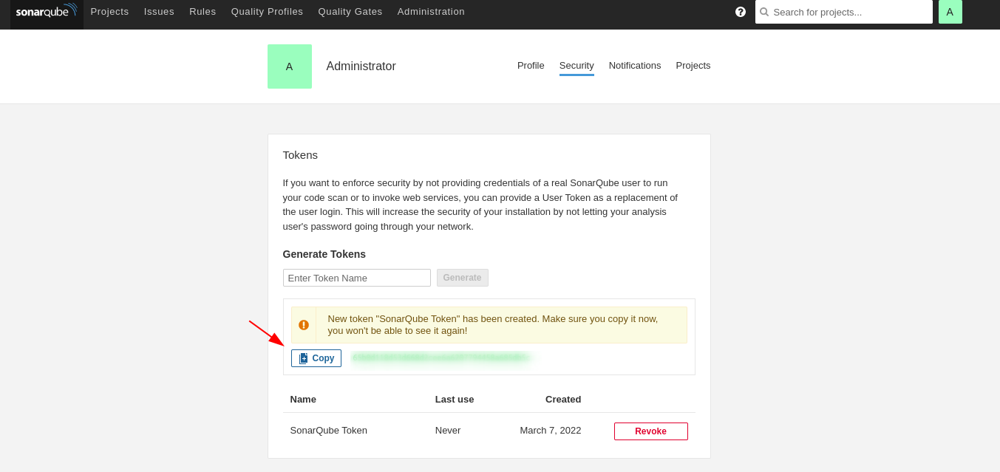

## Sonar

## 1. Logar no sonar

- URL: http://192.168.10.40/
- User: `admin`
- Password: `admin`

  

## 2. Redefinir senha `admin`.

  

## 3. Gerar `token` para integração com o `jenkins`.

- Passo 1:

  

- Passo 2:

  

- Passo 3:

  

- Passo 4:

  

- Passo 5:

  

## Configurar `webhook`
