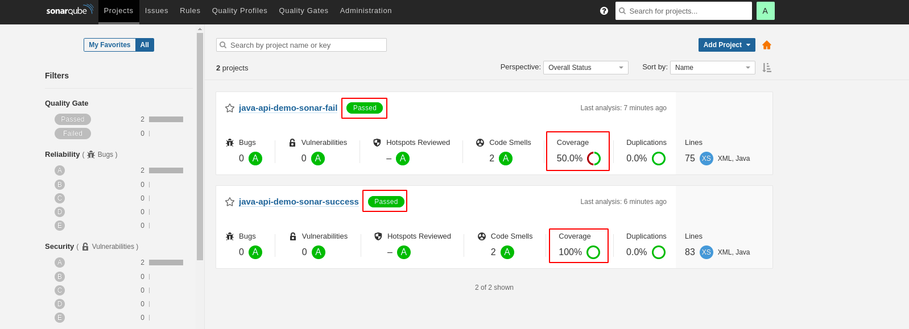
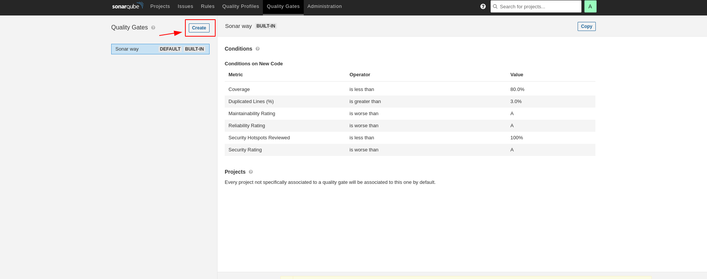
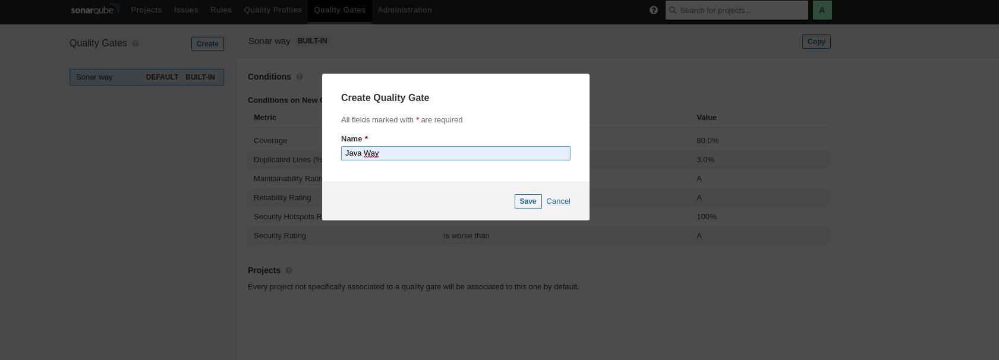
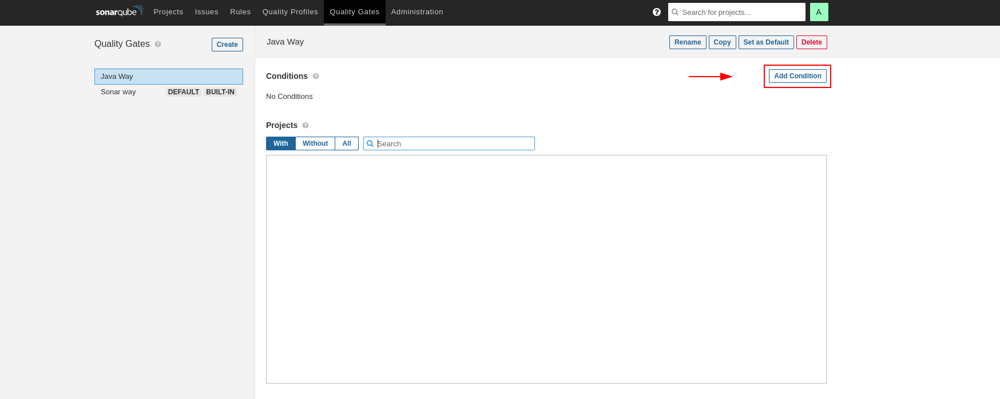
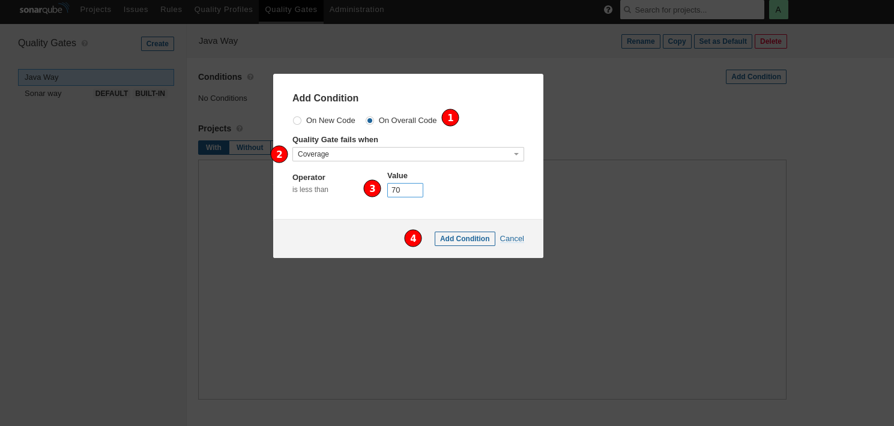
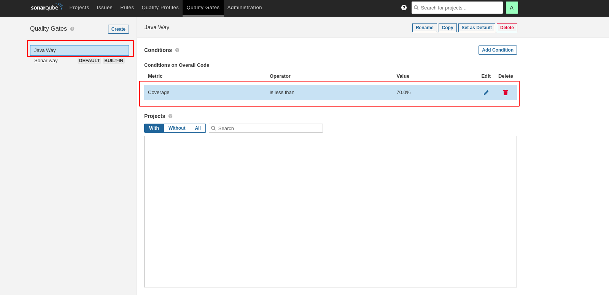
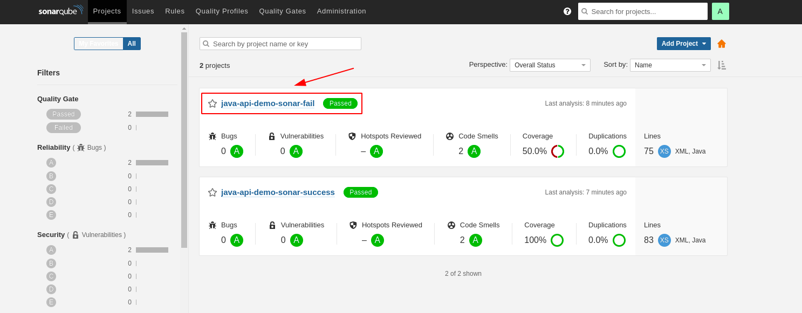
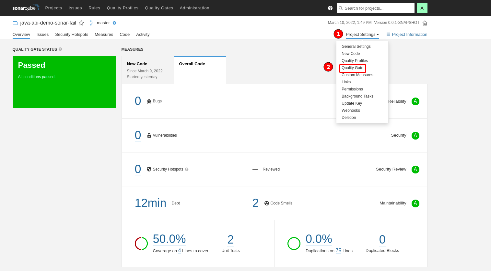
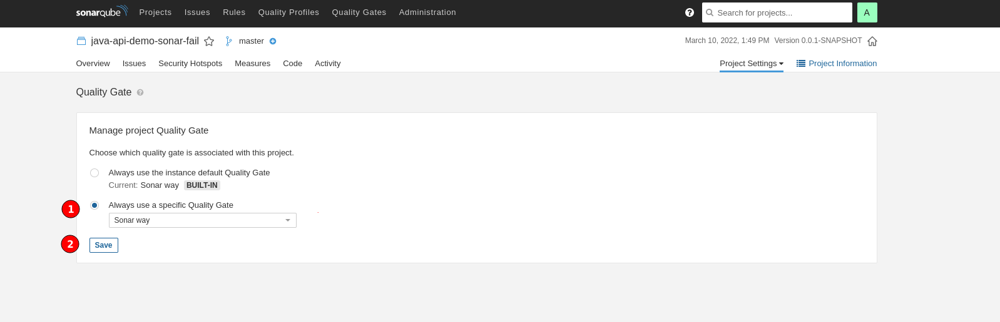
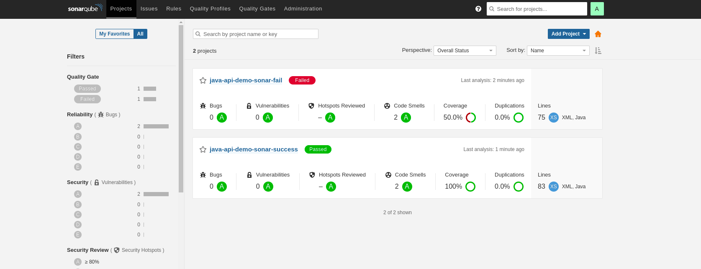

## 1. Projetos utilizando o Quality Gate padrão `Sonar Way`.

- Os dois projetos utilizado o `Quality Gate` padrão.

  

## 2. Criando o `Quality Gate`

- Passo 1: Quality Gates

  

- Passo 2: Create

  

- Passo 3: Dando nome ao novo Quality Gate

  

- Passo 4: Adicionar uma condição

  

- Passo 5: Cobertura de código menor que 70%

  

- Passo 6: Quality Gate criado

  

## 3. Atribuindo o Quality Gate ao projeto

- Passo 1:

  

- Passo 2:

  

- Passo 3:

  

## 4. Projetos utilizando o `Quality Gate` criado, `Java Way`.

  

