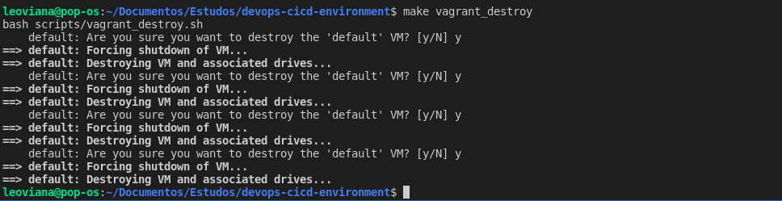

<p align="center">
  
</p>


## Vagrant e virtualbox

- Criação do ambiente com `vagrant` e `virtualbox`. Cada serviço terá sua própria vm, onde cada diretório possui uma `vagrantfile` onde é passado algumas informações de cada vm, como hostname, ip, tamanho de cpu, memória, copia a chave `ssh` vagrant criada na etapa anterior e também chamará um script chamado `bootstrap.sh`, esse script possui algumas funções para configurações.

- bootstrap.sh
    - ensure_netplan_apply
    - resolve_dns
    - install_docker
    - install_openssh
    - setup_root_login
    - setup_welcome_msg

- Nesse exemplo utilizo apenas as funções `setup_root_login` e `setup_welcome_msg`. A instalação do docker por exemplo, é utilizado uma role para ser subida com `ansible`.

## Inicalização das vms

1. Forma 1:

- Entrar direto no diretório de cada um e usar o comando: `vagrant up`.

```console
cd vagrant/jenkins
vagrant up
```

2. Forma 2:

- Utilizar o comando `make vagrant_up` que ele levantara toda a infraestrutura de uma vez

```console
make vagrant_up
```

## Destruindo as VMs

- Caso queira destruir as VMs criadas pode entrar em diretorio por diretorio e usar o comando:
```console
vagrant destroy
```

- Ou pode utilizar um único comando para destruir todas de uma vez:
```console
make vagrant_destroy
```
<p align="center">
  
</p>