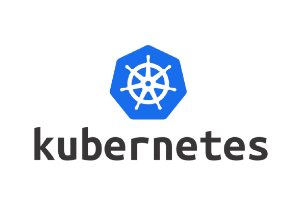

<!-- <h1 align="center">Kubernetes</h1> -->

  

## 🚀 Execução
1. [Subindo o kubernetes com vagrant e vitualbox](./docs/configuracoes_iniciais.md) 
2. [Instalando o Dashboard](./docs/dashboard.md)
3. [Baixando e instalando o LENS](https://k8slens.dev/)
5. [Subindo o argo cd](./docs/argo.md)