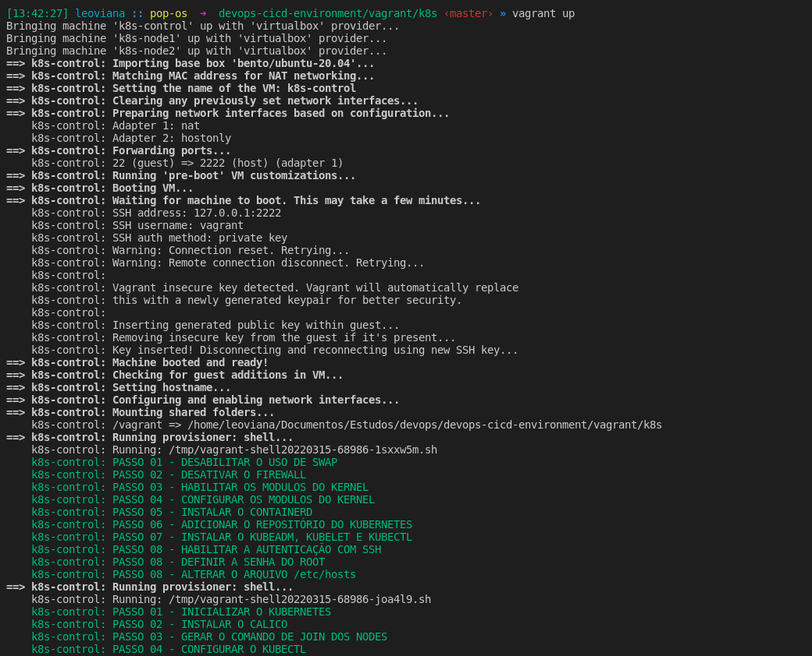
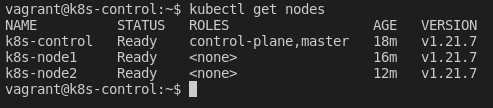

## Iniciar instalação
```console
vagrant up
```

<p align="center">
  
</p>

## Logar no control plane
```console
vagrant ssh k8s-control
```

## Configurar o `Kubectl`
```console
mkdir -p $HOME/.kube
sudo cp -i /etc/kubernetes/admin.conf $HOME/.kube/config
sudo chown $(id -u):$(id -g) $HOME/.kube/config
```

## Verificação

- Verificando os nodes
```console
kubectl get nodes
```

<p align="center">
  
</p>
