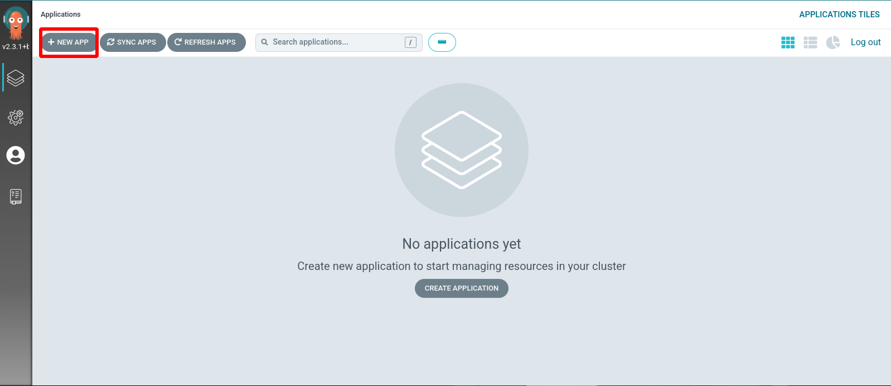
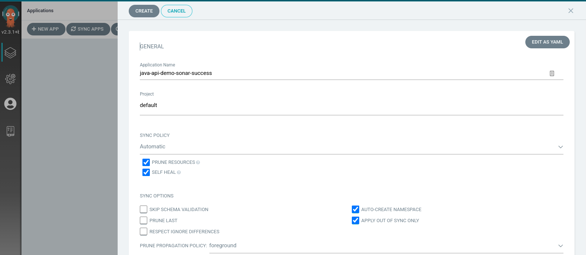
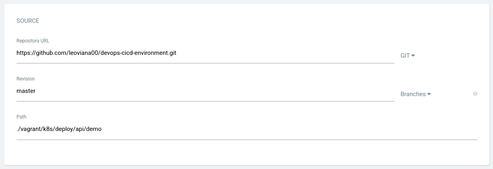
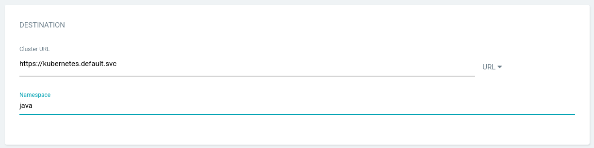
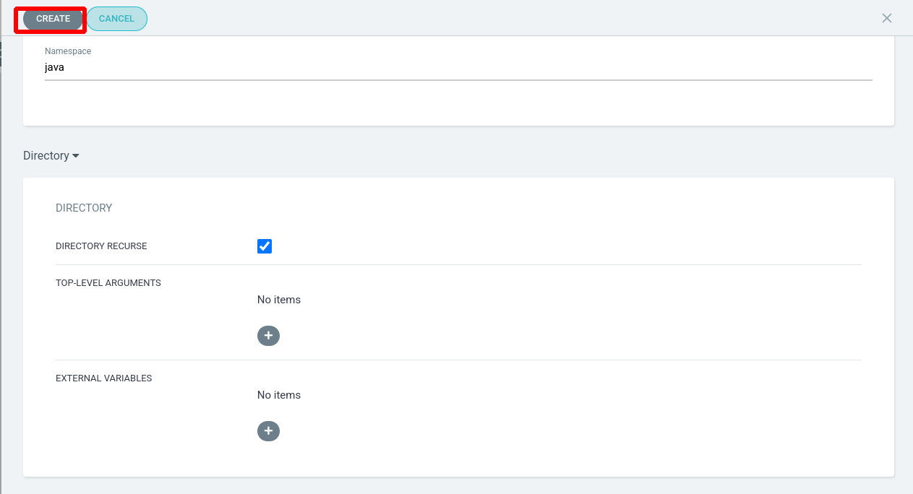
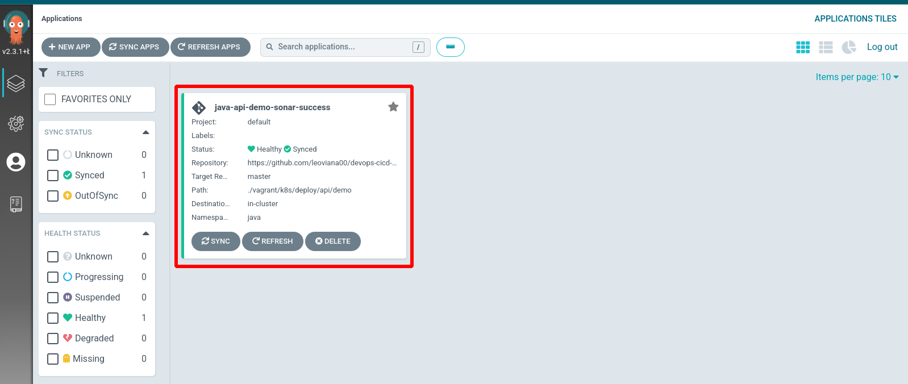
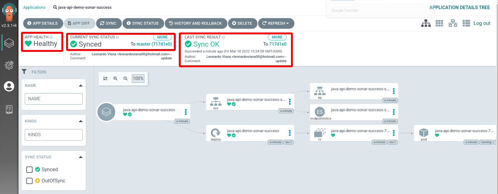
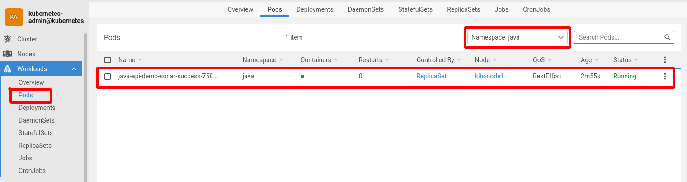

<h1 align="center">Deploy com argocd</h1>

1. Criar um `app`

  

2. Preencher com as informações necessárias 

- General

  

- Source

  

- Destination

  

- Directory

  

3. Projeto criado

  

  

3. Verificando dashboard lens

  

