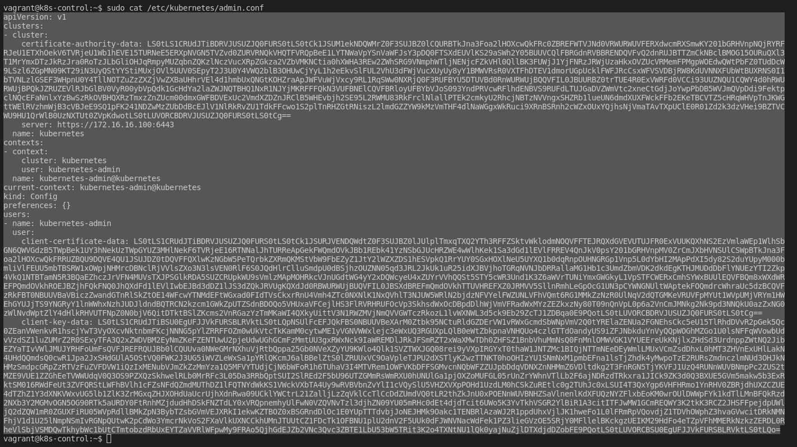
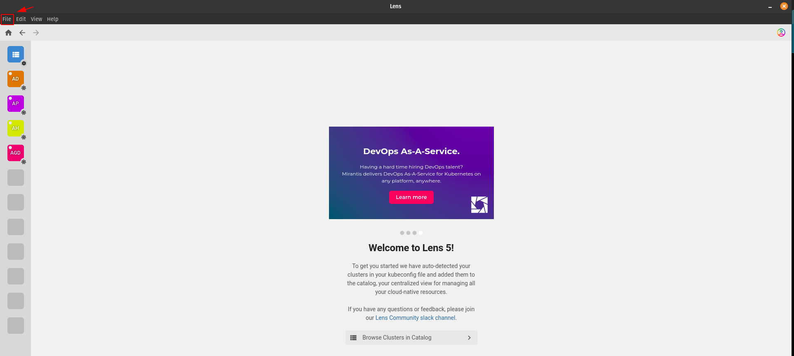
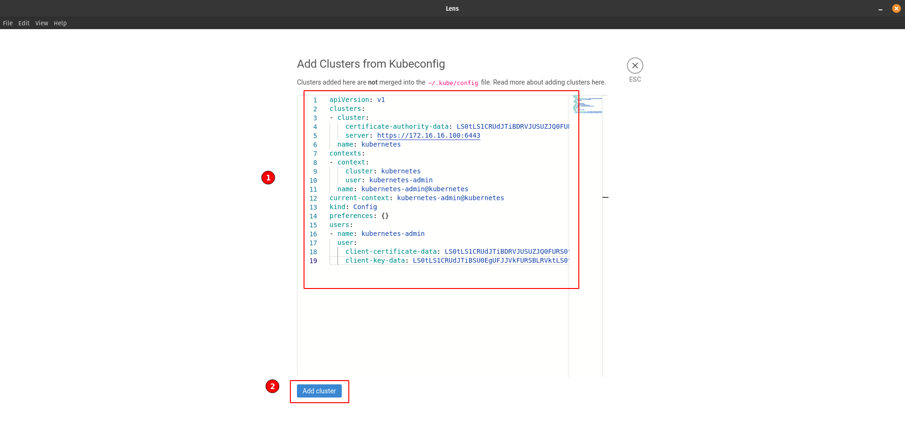
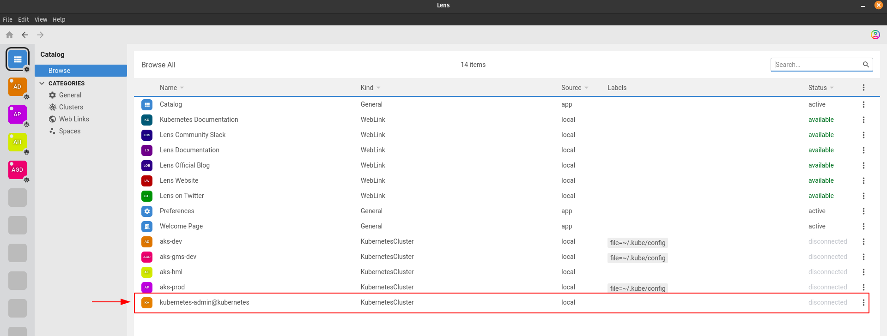
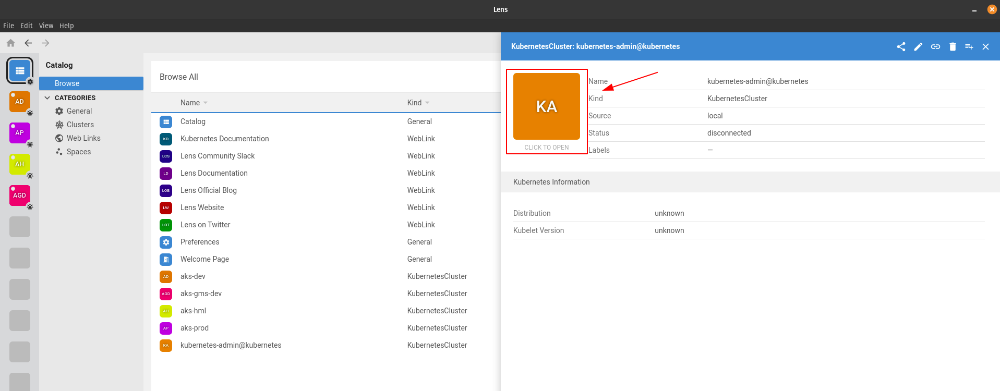
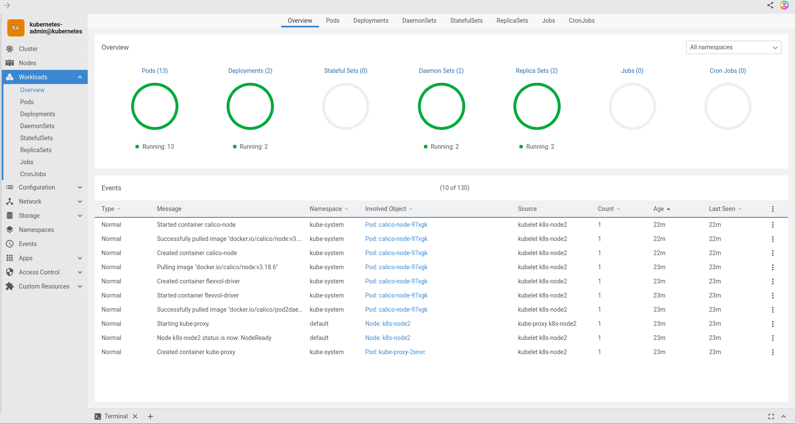

## Baixar e instalar o `LENS`

- [Download](https://k8slens.dev/)

## Adicionando o cluster no `LENS`

1. Logar no `control plane`

```console
vagrant ssh k8s-control
```

2. Copiar o conteúdo do `admin.conf`

```console
sudo cat /etc/kubernetes/admin.conf
```

<p align="center">
  
</p>

3. Abrir o `lens` e ir em `file`

<p align="center">
  
</p>

4. Colar o conteúdo do `admin.conf` e `add cluster`

<p align="center">
  
</p>

5. Visualizar o `cluster` no `Browse` e clicar nele

<p align="center">
  
</p>

4. Abrindo o `cluster`

<p align="center">
  
</p>

5. Dashboard

<p align="center">
  
</p>