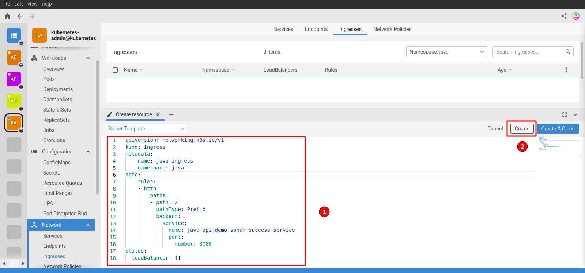
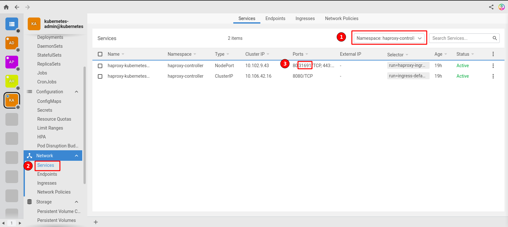
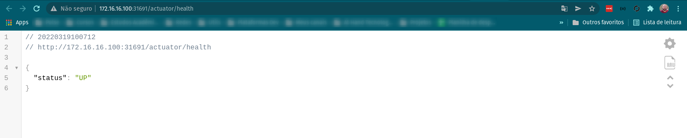

## Install with kubectl

```console
kubectl apply -f https://raw.githubusercontent.com/haproxytech/kubernetes-ingress/v1.7/deploy/haproxy-ingress.yaml
```

## Check your installation

```console
kubectl get pods -A
```

```console
kubectl get svc -A
```

## Verificando pelo `LENS`

<p align="center">
  
</p>

## Criando um ingress para a aplicação java que foi deployada.

1. Passo:
<p align="center">
  
</p>

2. Passo: Arquivo do recursos localizado em `/vagrant/k8s/deploy/ingress`
<p align="center">
  
</p>

## Verificando a porta do haproxy controller

<p align="center">
  
</p>

## Acessando a aplicação através do ingress

- O ip pode ser o de qualquer um dos `nodes`, a porta gerada pelo haproxy controller mais o path da aplicação. Nesse exemplo seria:

- http://172.16.16.100:31691/

<p align="center">
  
</p>

- Ou a rota de health check

- http://172.16.16.100:31691/actuator/health

<p align="center">
  
</p>
